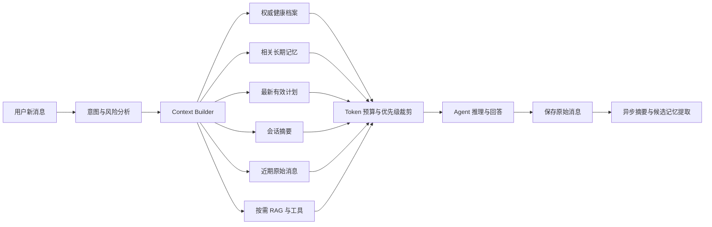

# SlimAgent AI 应用与 AI Agent 项目亮点

> [!important] 使用原则
> 这份笔记同时服务于项目设计、技术复盘、简历编写和面试准备。必须始终区分“已实现”“开发中”“规划中”，未落地和未验证的能力不能提前写成简历成果。

## 1. 项目定位

SlimAgent（简历展示名可使用 FitPlanAI）不是一个只调用大模型生成文案的聊天应用，而是面向健身、营养和健康管理场景的 AI Agent 系统：将用户档案、结构化业务数据、RAG 专业知识、工具调用、风险规则、多轮对话和反馈闭环组合成可执行、可校验、可持续调整的个性化方案。

一句话介绍：

> 基于 FastAPI、LangGraph、结构化数据和 Agentic RAG 构建个性化健康管理 Agent，支持计划生成、多轮对话、工具调用、流式输出、健康风险约束与反馈驱动调整；通过 Token 预算、增量摘要、Artifact Microcompact 和受治理的跨会话长期记忆保持上下文连续性。

## 2. 状态图例

| 标记 | 含义 | 是否可以写入简历成果 |
| --- | --- | --- |
| ✅ 已实现 | 代码中已经存在，并有测试或构建证据 | 可以，但表述必须与实际一致 |
| 🚧 开发中 | 已确定方案，正在实现 | 只能说“正在建设” |
| 🧭 规划中 | 设计方向，尚未实现 | 不能写成已完成成果 |
| 📊 待量化 | 已实现但缺少指标或评测 | 可以描述技术，不能编造数字 |

## 3. 当前已经形成的 AI 项目亮点

### 3.1 Agentic RAG：让回答有业务上下文和专业依据 ✅

- 根据用户问题、训练水平、目标、伤病、过敏和忌口构造检索条件。
- 检索结果不仅进入提示词，还将真实来源、证据等级和相似度随消息持久化并展示。
- 无可靠检索结果时明确提示依据不足，避免模型伪造来源。
- 健康风险识别与知识检索被编排为 LangGraph 工作流，而不是散落在接口中的临时代码。

对应代码：

- [聊天图工作流](../backend/app/graph/chat_workflow.py)
- [RAG 检索器](../backend/app/rag/retriever.py)
- [聊天服务](../backend/app/services/chat_service.py)

面试价值：这说明项目处理的不只是 Prompt，而是“检索条件构造—证据召回—上下文注入—引用回传—无证据降级”的完整 RAG 链路。

### 3.2 ReAct Agent + 确定性业务护栏 ✅

- 计划生成使用 LangGraph 与 `create_react_agent`，模型可以调用热量计算、动作检索、食物检索和知识检索等工具。
- LLM 输出被视为不可信输入，后端继续校验食物 ID、动作 ID、宏量营养范围、单项克重、每日总重、训练天数、训练时长和动作数量。
- Agent 失败时具有确定性降级路径，不把外部模型波动直接暴露为业务失败。
- 用户确认后的计划调整使用旧版本基线进行并发控制，避免重复请求覆盖新计划。

对应代码：

- [计划 Agent 工作流](../backend/app/graph/workflow.py)
- [计划调整接口](../backend/app/api/plan.py)

面试价值：核心不是“用了 ReAct”，而是能够解释为什么 Agent 自主性与后端确定性约束必须同时存在。

### 3.3 可持久化、多会话、流式聊天 Agent ✅

- 会话和消息存入数据库，支持创建、列表、查看详情和归档。
- SSE 流式返回元数据、文本增量、引用和最终消息。
- 回答时通过统一 Context Builder 按 token 预算加载用户档案、最新计划、页面上下文、会话摘要、近期聊天和实际可用的 RAG 资料。
- 将“用于诊断和压缩策略的 token 估算”与“用于模型调用门禁的保守上界”分离；系统规则、本轮消息和末尾数据边界无法放入预算时，在模型调用前明确拒绝。
- 消息记录包含引用、业务上下文摘要和生成状态，可区分完成、停止与失败。
- 会话达到阈值后在流结束阶段触发增量摘要，以覆盖游标记录摘要边界；摘要失败不推进游标，也不阻塞当前聊天。

当前局限：

- 没有跨会话长期用户记忆。
- 没有让用户查看、确认、修改和删除 AI 记忆的界面。
- 真实模型下的摘要事实保持率、token 降幅和延迟仍待量化。

对应代码：

- [聊天数据模型](../backend/app/models/user.py)
- [聊天 API](../backend/app/api/chat.py)
- [聊天前端](../frontend/src/views/ChatView.vue)

### 3.4 结构化数据锚定，减少模型幻觉 ✅

- 饮食计划和训练计划采用结构化 JSON，而不是只保存大段自然语言。
- 餐食使用食物数据库中的可信营养数据，动作使用标准动作 ID 和结构化动作库。
- LLM 负责理解、选择和组织，数据库与后端规则负责事实和边界。
- 结构化计划为后续计划调整、统计分析和前端交互提供基础。

面试价值：体现“LLM 负责概率性判断，程序负责确定性约束”的 AI 应用工程思维。

### 3.5 多模态输入进入真实业务流程 ✅ / 📊

- 支持餐食、食材、体型照片和训练动作视频等多模态分析场景。
- 识别结果不是终点，而是继续进入营养核算、动作反馈或计划生成流程。
- 对不可信文件类型、模型异常、解析失败和生成服务异常具有校验与降级逻辑。

待补充指标：识别准确率、用户纠错率、平均处理耗时和失败率。

### 3.6 反馈驱动的计划调整闭环 ✅

- 通过打卡和阶段复盘获得体重、执行情况、饥饿感、训练表现和疼痛等反馈。
- 先生成调整草案，用户确认后再写入正式计划。
- 饮食和训练调整受到热量、宏量营养、训练频率、时长和安全规则约束。
- 使用并发基线校验防止旧页面或重复请求覆盖新版本计划。
- 长期记忆确认/编辑由数据库 active slot 唯一约束兜底，并把并发竞争转换为 `409 Conflict`，避免未处理的 500。

面试价值：将“一次性生成”升级为“生成—执行—反馈—调整”的闭环 Agent 产品。

## 4. 已落地核心亮点：分层上下文与长期记忆 ✅

### 4.1 为什么它会成为项目亮点

普通聊天应用通常只做两件事：把最近若干消息拼进 Prompt，或者在超长后生成一个摘要。这会产生四类问题：

1. 对话越长，token 成本和延迟越高。
2. 固定截断会遗忘早期目标、限制条件和未完成事项。
3. 摘要可能把用户猜测变成永久事实。
4. 会话内摘要不能解决跨会话个性化问题。

SlimAgent 已完成这套 Context Engineering 与 Memory 系统的 M0-M5.0 纵向切片：在 token 预算内组装分层上下文，通过会话摘要和 Artifact Microcompact 控制长对话体积，并以受治理的混合检索召回跨会话记忆。完整记忆中心 UI 属于 M5.1，真实流量量化属于 M6。

### 4.2 参考 Claude Code 后得到的架构启发

本次研究参考了本地 `D:\\develop\\project\\claude` 和 [claude-code-haha](https://github.com/Hmx-7488/claude-code-haha)。该仓库自述为修复后的泄露源码，不是官方开源实现，因此只参考架构思想，不复制源码，也不将其作为权威规范。

值得借鉴的机制：

- **Microcompact**：优先压缩旧工具结果、RAG 文档和大对象，暂不破坏用户对话。
- **Session Memory**：后台增量提炼当前任务状态，而不是等上下文溢出后一次性总结。
- **覆盖游标**：记录摘要覆盖到哪条消息，避免重复总结、漏消息或摘要边界不清。
- **Recent Tail**：压缩后仍保留足够的近期原始消息，维持语气、指代和局部推理连续性。
- **压缩熔断与降级**：摘要失败时继续使用旧上下文或传统压缩，不无限重试。
- **渐进式 Skill 加载**：初始只暴露名称、描述和触发条件，调用时才加载完整指令。
- **上下文体检**：统计系统提示、Skill、MCP 工具描述、RAG 结果和聊天消息分别占用多少 token。

### 4.3 SlimAgent 必须采用的三层记忆模型

Claude Code 的 Session Memory 面向编码任务连续性，不能直接等同于健康应用的用户长期记忆。SlimAgent 应明确拆分为三层：

| 层级 | 典型内容 | 生命周期 | 权威级别 |
| --- | --- | --- | --- |
| 会话摘要 `conversation_summary` | 本次对话目标、已得结论、待办、最近决策 | 单会话 | 中 |
| 长期用户记忆 `user_memory` | 稳定饮食偏好、训练习惯、长期目标、用户确认的经验 | 跨会话 | 中高 |
| 权威用户档案 `user_profile` | 身高体重、过敏、疾病、伤病、医生限制 | 持续存在 | 最高 |

冲突优先级：

```text
用户本轮明确输入 > 权威用户档案 > 用户确认的长期记忆 > 会话摘要 > 模型推断
```

会话摘要只能说明“聊过什么、当前做到哪里”；长期记忆负责“以后是否还应该记得”；健康档案负责“哪些事实和风险约束必须执行”。三者不能混成一个大摘要。

### 4.4 目标上下文构建流程



建议的上下文优先级：

1. 系统安全规则与当前用户请求。
2. 过敏、伤病、药物和医生限制等硬约束。
3. 当前有效计划及本轮页面业务上下文。
4. 与当前问题相关、且已经确认的长期记忆。
5. 会话摘要和未完成事项。
6. 近期原始消息。
7. RAG 文档与工具输出；过长时优先微压缩这一层。

### 4.5 长期记忆写入原则

候选记忆不能由模型提取后直接永久生效。建议流程：

```text
原始对话
  -> 候选记忆提取
  -> 类型与敏感级别分类
  -> 去重、冲突和时效检查
  -> 普通偏好自动保存 / 健康敏感信息请求确认
  -> 写入长期记忆并记录来源消息
  -> 后续检索使用
```

每条长期记忆至少需要：

- `memory_type`：偏好、目标、习惯、限制、经历或阶段结论。
- `content`：结构化事实与可读文本。
- `source_message_id`：来源消息，便于追溯。
- `confidence`：模型提取置信度，不等同于事实可信度。
- `confirmation_status`：候选、已确认、已拒绝。
- `valid_from` / `valid_until`：处理临时目标和过期信息。
- `supersedes_memory_id`：新记忆替代旧记忆，而不是静默覆盖。
- `created_by`：用户明确输入、系统同步或模型提取。

健康敏感信息、伤病、过敏、用药和医生限制默认需要用户确认，且正式用户档案始终拥有更高优先级。

### 4.6 Skill 与 MCP 的项目策略

#### Skill

适合将稳定、可复用、需要明确边界的领域流程做成 Skill，例如：

- 阶段复盘与计划调整 Skill。
- 餐食分析 Skill。
- 动作风险审查 Skill。
- 补剂证据审查 Skill。
- 记忆提取与冲突检查 Skill。

采用渐进式加载：上下文中只放 Skill 的轻量元数据，真正选择该能力后才加载完整说明和依赖资料，避免所有提示词常驻。

#### MCP

当前不应把所有内部 Python 服务重新包装成 MCP。内部调用继续使用 LangChain Tool 和 service 层，降低复杂度。未来可提供少量只读 MCP 能力，让外部 AI 客户端查询：

- 用户当前计划摘要。
- 今日营养与训练目标。
- 动作和食物知识库。
- 用户授权后的阶段复盘数据。

涉及修改档案、写入计划和健康敏感数据的 MCP 工具必须具备细粒度授权、确认和审计，不能默认开放。

## 5. 分阶段开发路线

### 阶段 M0：架构决策与评测基线

状态：✅ 已完成（2026-08-11）

- 编写 Context & Memory ADR，确定边界、优先级和失败策略。
- 建立长对话测试集：目标变更、偏好冲突、伤病更新、跨会话追问、旧信息过期。
- 记录当前“最近 10 条消息”方案的 token、延迟和回答正确率，作为对比基线。
- 明确隐私、确认、编辑和遗忘规则。

验收结果：已形成 [[ADR-001-分层上下文与长期记忆]]、6 个固定评测场景和可重复运行的离线评测器；当前 Context availability 基线为 50.0%，安全事实可见率为 50.0%。详细结果见 [[上下文与记忆-M0基线报告]]。

### 阶段 M1：Token 预算与 Context Builder

状态：✅ 已实现（2026-08-11，真实模型指标待量化）

- 按当前模型获取或配置 context window。
- 对系统提示、档案、计划、记忆、消息、RAG 和工具输出分别估算 token。
- 实现按优先级组装、裁剪和诊断日志。
- 保留现有最近消息路径作为降级方案。

验收结果：Context Builder 能按配置预算确定性组装上下文，优先保留权威档案，并在消息元数据中记录各组件 token、历史/RAG 取舍和摘要版本。

### 阶段 M2：会话摘要与覆盖游标

状态：✅ 已实现（2026-08-11，真实长对话评测待补充）

- 新增 `conversation_summaries`，保存结构化摘要和 `covered_through_message_id`。
- 支持增量摘要，不重复总结已覆盖消息。
- 压缩后使用“摘要 + 近期消息尾部”。
- 摘要失败时不破坏原始 transcript，并回退到安全截断。

验收结果：已实现版本化摘要、覆盖游标、近期原始消息尾部、流结束后台触发及失败不推进游标；专项自动化测试通过。真实模型下“早期目标/未完成事项”回答正确率仍需 M6 评测，不能提前宣称量化提升。

### 阶段 M3：工具与 RAG 结果 Microcompact

状态：✅ 已实现（2026-08-11，生产指标待量化）

- 大型工具结果单独存储，消息上下文只保留可验证摘要和结果引用。
- 优先淘汰旧的低相关 RAG 文档，不优先删除用户原始表达。
- 对摘要保留来源 ID、关键数值和约束，避免压缩后失真。

验收结果：聊天 RAG 已接入通用 Artifact Microcompact；短内容保留全文，长内容优先保留健康风险、否定词和关键数字，所有处理模式均保留引用与 token 诊断。固定 4 用例评测为 4/4，通过样例 token 减少 91.9%；该数字仅为构造离线集结果，不代表生产平均值。详见 [[上下文与记忆-M3-Microcompact实现记录]]。

### 阶段 M4：跨会话长期记忆

状态：✅ 已实现（2026-08-11，真实模型与生产指标待量化）

- 新增 `user_memories` 与记忆变更审计。
- 实现候选提取、去重、相关性召回、冲突检测、过期和替代。
- 将确认过的记忆加入后续聊天和计划生成。
- 健康敏感记忆默认进入待确认状态。

验收结果：已实现只从用户原话提取候选、服务端健康敏感复核、普通记忆自动确认、敏感候选确认、内容指纹去重、同 key 显式替代、时效和软删除，并接入聊天 Context Builder 与计划生成。固定 4 场景离线评测 4/4，precision/recall 为 100%；该结果仅代表构造样例，不代表生产流量。详见 [[上下文与记忆-M4-长期记忆实现记录]]。

### 阶段 M5：长期记忆混合检索与用户可控记忆中心

状态：🚧 M5.0 混合检索已完成；M5.1 完整记忆中心待开发

- 已实现 keyword/vector/hybrid、RRF、SQLite 终检、事务 outbox、幂等重试、重建/孤儿清理和实际使用追踪。
- 用户可以查看“Agent 记住了什么”。
- 支持确认、纠正、删除和禁止某类信息被记住。
- 在回答或计划中展示关键个性化依据，说明使用了哪条记忆。

验收：所有长期记忆均可追溯、可修改、可遗忘，敏感数据不会静默永久保存。

### 阶段 M6：三模式评测、观测与简历量化

状态：🧭 规划中

- 构建记忆召回准确率、冲突处理正确率、摘要事实保持率和健康约束遵守率评测。
- 固定比较 keyword/vector/hybrid 的 Recall@K、MRR、延迟、降级率和 embedding 成本，基于数据调节 RRF 与候选窗口。
- 记录每轮上下文 token、压缩次数、记忆命中、摘要耗时和降级次数。
- 对比改造前后的 token、延迟、回答质量和跨会话任务完成率。

建议目标，需要在 M0 基线后校准：

- 长对话上下文 token 降低 40% 以上。
- 人工构造测试集中，已确认长期记忆召回准确率达到 90% 以上。
- 硬性健康约束遵守率达到 100%。
- 被删除、拒绝或过期记忆的使用次数为 0。
- 摘要和记忆系统失败时，聊天主链路仍可安全降级。

## 6. 已完成的第一轮开发范围

第一轮按可验证纵向切片完成：

1. Context & Memory ADR 和评测样例。
2. Token 预算与上下文诊断。
3. 会话摘要表与覆盖游标。
4. “摘要 + 近期消息”上下文构建。
5. 摘要失败降级与自动化测试。

这条 M1/M2 切片完成后，项目继续完成 M3 Artifact Microcompact、M4 跨会话 `user_memories` 与 M5.0 混合检索，从长上下文治理逐步扩展到具备隐私、错误记忆、异步索引一致性和可解释召回的长期个性化。

## 7. 面试表达框架

### 7.1 30 秒版本

> 我在 SlimAgent 中没有简单地把最近聊天全部塞给模型，而是实现了 token 预算驱动的 Context Builder：会话内通过增量摘要和覆盖游标压缩旧历史，RAG/工具结果单独微压缩；跨会话记忆只从用户原话提取并经过确认、敏感复核、去重、替代、时效和删除治理，再通过关键词与向量两路召回、RRF 融合和 SQLite 版本终检进入上下文。权威档案和本轮输入始终高于长期记忆，每轮还记录检索通道、排名和实际使用状态。

### 7.2 两分钟深挖顺序

1. 先说明固定最近 N 条消息的问题。
2. 解释 transcript、会话摘要、长期记忆和权威档案为什么要分层。
3. 解释 `covered_through_message_id` 如何保证增量摘要边界。
4. 解释为什么先压缩工具/RAG 结果，再压缩用户对话。
5. 解释健康敏感记忆为什么必须确认、可追溯和可删除。
6. 给出 token、召回正确率、冲突处理和安全约束的评测结果。

### 7.3 高频追问

#### 为什么不用向量库直接存全部聊天？

向量相似度只能解决“像不像”，不能保证时效、权威级别、冲突关系和用户确认。长期记忆需要结构化元数据、覆盖关系和权限；原始聊天可用于追溯，向量检索只是召回手段之一。

#### 摘要错误怎么办？

保留完整 transcript；摘要记录覆盖游标和版本；关键健康事实不从摘要获得权威性；摘要失败可回退到近期消息；评测摘要中的关键事实、数字和未完成事项是否保持。

#### 如何避免错误记忆污染后续计划？

候选记忆先分类和冲突检查；健康敏感信息要求用户确认；保存来源消息；正式档案优先于长期记忆；新事实通过替代关系覆盖旧事实；用户可以查看和删除。

#### 为什么不用固定最近 10 条？

不同消息、工具结果和模型窗口的 token 差异很大。固定条数既可能浪费窗口，也可能丢掉早期关键约束，因此应使用 token 预算、结构化摘要和相关记忆召回。

#### Skill 和 MCP 各自解决什么？

Skill 封装 Agent 内部可复用的领域工作流和提示规范；MCP 解决跨应用、跨运行时的标准化工具与数据接入。当前项目优先做内部 Skill/Tool 工程化，只有明确外部集成需求时再提供最小 MCP 接口。

## 8. 简历素材

### 8.1 当前可使用

> 基于 FastAPI、LangGraph 与 Agentic RAG 构建健康管理 Agent，将用户档案、最新计划、页面上下文和专业知识检索结果注入多轮对话；实现会话/消息持久化、SSE 流式响应、真实引用回传及高风险健康问题降级。

> 设计 ReAct 工具调用与确定性校验结合的计划生成链路，使用结构化食物/动作数据约束模型输出，并对营养范围、训练约束、伤病风险及并发计划更新进行后端校验，降低 LLM 幻觉和异常输出对业务的影响。

### 8.2 当前可描述技术、获得真实流量指标后补数字

> 设计并实现面向长对话的分层 Context Engineering 系统，通过工具结果微压缩、增量会话摘要、消息覆盖游标、近期上下文保留及跨会话长期记忆召回，将平均上下文 token 降低 **[实测值]%**，并在自建评测集中实现 **[实测值]%** 的记忆召回准确率。

> 构建可追溯、可确认、可纠正和可遗忘的用户记忆机制，区分会话摘要、长期偏好和权威健康档案，通过来源追踪、冲突替代、有效期和敏感信息确认机制，保证健康硬约束测试通过率 **[实测值]%**。

> 将长期记忆召回升级为 Hybrid Retrieval：以 SQLite 作为生命周期真值，结合中文关键词与独立 Chroma 向量召回并用 RRF 融合，通过 `content_fingerprint + index_revision` 终检、事务 outbox、幂等重试和 orphan cleanup 解决异步索引陈旧读与最终一致性问题；持久化检索通道、排名、降级原因和实际上下文使用状态，为后续 Recall@K/MRR 与成本评测建立数据基础。

不得提前填写或虚构方括号中的指标。

## 9. 已确认并执行的产品决策

### 决策 A：敏感记忆确认策略

已执行：普通偏好达到置信度阈值后可自动确认；低置信度内容，以及伤病、过敏、疾病、药物、进食障碍等敏感信息必须用户确认后才能成为长期记忆，且不会自动更新正式档案。

### 决策 B：第一轮是否包含前端记忆中心

已执行：先完成后端会话压缩与上下文诊断；M4 同步提供最小记忆抽屉，支持查看、确认、拒绝和遗忘，避免出现完全不可见的隐形记忆。M5.0 已先完成混合召回和可观测数据底座，完整编辑、来源和策略控制进入 M5.1。

### 决策 C：记忆提取模型

已执行：第一版复用当前兼容 API 的文本模型，使用严格 Pydantic 输出、后端敏感复核和异步提取；是否切换更便宜的小模型由 M6 的成本与质量数据决定。

### 决策 D：原始聊天保留策略

已执行：当前个人项目保留完整聊天供追溯，归档不等于删除；已支持长期记忆软删除、向量异步清理和全量索引重建。真正删除会话及摘要/来源级联清理进入 M5.1。

## 10. 关联文档

- [[ADR-001-分层上下文与长期记忆]]
- [[上下文与记忆-M0基线报告]]
- [[上下文与记忆-M1-M2实现记录]]
- [[上下文与记忆-M3-Microcompact实现记录]]
- [[上下文与记忆-M4-长期记忆实现记录]]
- [[上下文与记忆-M5-混合检索实现记录]]
- [[数据层接入与Agent升级-技术设计文档]]
- [[减脂Agent-Agentic-RAG-开发文档]]
- [[Boss直聘AI岗位调研与FitPlanAI简历项目包装]]
- [[减脂Agent项目需求文档]]

## 11. 更新日志

- 2026-08-12：完成 M5.0 长期记忆混合检索；新增独立 Chroma collection、keyword/vector/hybrid 三模式、RRF、SQLite 版本终检、事务 outbox、幂等重试/重建/孤儿清理以及聊天/计划实际使用追踪。M6 调整为三模式质量、延迟与成本评测，不再决定是否采用 hybrid。
- 2026-08-12：完成 M4 全量校验与独立复核；补齐记忆 API 部署边界鉴权、Prompt 注入防护、时区归一化、并发唯一约束、旧库增量迁移、硬上下文预算及冲突回归测试。后端 242 项测试、前端生产构建与三套离线评测通过。
- 2026-08-11：完成 M4；新增受治理的跨会话长期记忆、聊天/计划召回、来源与审计、冲突替代、敏感确认和最小记忆管理入口。
- 2026-08-11：完成 M3；新增通用 Artifact Microcompact、聊天 RAG 接入、引用一致性诊断及固定离线评测。
- 2026-08-11：完成 M1/M2 代码；新增 Token Context Builder、上下文诊断、版本化会话摘要、覆盖游标、近期尾部与后台压缩降级。
- 2026-08-11：完成 M0；新增 Context & Memory ADR、6 个确定性长对话评测场景和当前上下文基线报告。
- 2026-08-11：建立项目 AI 应用 / AI Agent 亮点主笔记；记录当前聊天基线、Claude Code 上下文机制调研、分层记忆方案、开发路线和面试表达。
